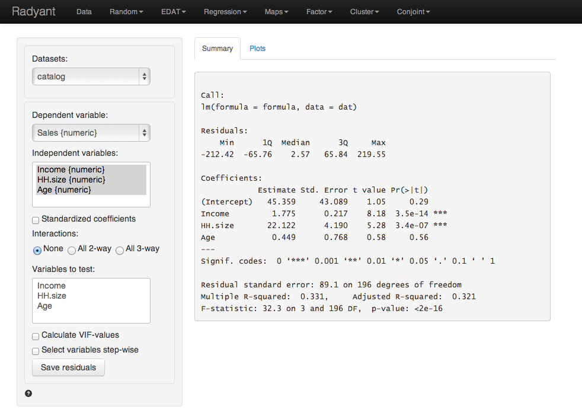

Note: Example files can be loaded from Data > Manage. Click the 'examples' radio button and press 'Load examples'.

#### Example 1:  Catalog sales

We have access to data from a company selling men’s and women’s apparel through mail-order catalogs (dataset 'catalog'). The company maintains a database on past and current customers’ value and characteristics. Value is determine as the total$ sales to the customer in the last year. The data are a random sample of 200 customers from the company’s database. The r-data contains a data frame with 200 observations on 4 variables

- Sales =  Total sales (in $) to a household in the past year
- Income = Household income ($1000) 
- HH.size = Size of the household (# of people) 
- Age = Age of the head of the household

The catalog company is interested in redesigning their Customer Relationship Management (CRM) strategies. We will proceed in two steps: 

1. Estimate a regression model using last year’s sales total. Dependent variable: sales total for each of the 200 households; explanatory variables: household income (measured in thousands of dollars), size of household, and age of the household head. The data-set is given in the ‘catalog’ data file. Interpret each of your estimated coefficients. Also provide a statistical evaluation of the model as a whole.
 
2. Which explanatory variables are significant predictors of customer value (use a 95% confidence level)? 

Answer:

Output from Radyant (Regression > Linear (OLS)) is provided below:

The F-statistic suggests that the regression model as a whole explains a significant amount of variance in Sales. The calculated F-value is equal to 32.33 and has a very small p-value (< 0.001). The amount of variance in sales explained by the model is equal to 33.1%

The null and alternate hypothesis for the F-test test can be formulated as follows:
H0: All regression coefficients are equal to 0
Ha: At least one regression coefficient is not equal to zero

The coefficients from the regression can be interpreted as follows:

For an increase in income of $1000 we expect, on average, to see an increase in sales of $1.7754, keeping all other factors constant.
- For an increase in household size of 1 person we expect, on average, to see an increase in sales of $22.1218, keeping all other factors constant.
- For an increase in the age of the head of the household of 1 year we expect, on average, to see an increase in sales of $0.45, keeping all other factors constant.

For each of the independent variables the following null and alternate hypotheses can be formulated:
H0: The coefficient associated with independent variable X is equal to 0
Ha: The coefficient associated with independent variable X is not equal to 0

The coefficients for 'Income' and ’HH.size' are both significant (p-values < 0.05), i.e., we can reject H0 for each of these coefficients. The coefficient for Age HH is not significant (p-value > 0.05), i.e., we cannot reject H0 for Age HH. We conclude that a change in Age of the household head does not lead to a significant change in sales.
