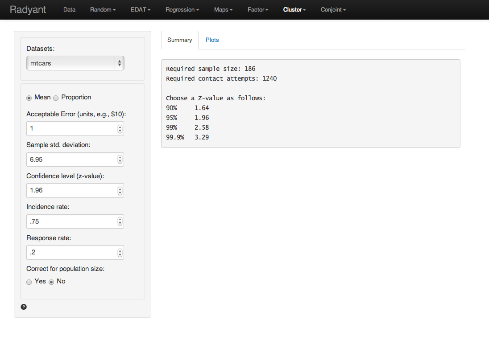

Calculate the required sample size when the researcher is interested in calculating with either a mean or a proportion from sample data.

#### Example 1

1. We would like to start an ISP and need to estimate the average Internet usage of households in one week for our business plan and model. How many households must we randomly select to be 95 percent sure that the sample mean is within 1 minute of the population mean . Assume that a previous survey of household usage has shown  = 6.95 minutes.

Answer:

Since we are interested in estimating the mean internet usage in the population of interest we select sample size calculation for a  Mean. In the screen shot below we entered 1 (minute) as the Acceptable error and 6.95 as the initial estimate of the Sample standard deviation. The Confidence level is 95% so we choose a z-value of 1.96.

As you can see the required sample size is equal to 186, i.e., we need 186 valid responses from our target population to make an inference of the population average with the required Acceptable Error, Confidence level, and Sample standard deviation. This number assumes a Incidence and Response rate of 100%. Suppose that only 75% of the household in out market have access to internet at their home. In addition the anticipated response rate is 20%. What would be the required number of household to contact?

In the screen shot above the incidence rate is set to 75% and response rate to 20%. The required number of valid responses is the same as before (186), however the number of contact requests is now equal to 186 / .75 / .2 = 1240.

[Source](http://www.isixsigma.com/tools-templates/sampling-data/how-determine-sample-size-determining-sample-size/)

#### Example 2

Suppose that you wish to investigate whether or not the true prevalence of HIV antibody in a population is 10%. You plan to take a random or systematic sample of the population to estimate the prevalence. You would like 95% confidence that the true proportion in the entire population will fall within the confidence level calculated from your sample.

Let's say that the population size is 5000, the estimate of the prevalence of 10%, and either 6% or 14% as the "worst acceptable" value, which is the end point of your confidence level. (Please note: the high and low values are calculated by adding and subtracting your confidence level, in this case "4", to your estimate of the prevalence.)

Population Value = 5000
Expected Frequency of the Factor under Study = 10%
Worst Acceptable Frequency = 14% or 6%

[Source](http://bphc.hrsa.gov/policiesregulations/performancemeasures/patientsurvey/calculating.html)

#### Example 3

Suppose you want to evaluate the compliance of your center with standard Quality Assurance procedures or with the Clinical Measures. You plan a random or systematic sample of the center's charts, and seek a 95% confidence level that the sample is representative of all the center's charts and that the compliance rate will fall within the confidence level you desire. As this is a measure of how personnel perform a task, you would expect a high rate of compliance in completing a required task. Thus, it is strongly suggested that you use 95% (no lower than 90%) as your Expected Frequency, as 99.9% perfection is not a reasonable expectation. Performance is expected of all trained personnel and should not fall below a reasonable level. This level is suggested as 85% (no lower than 80%) for the "Worst Acceptable" value. The population size will equal the population of the life cycle or subset: in this example we will use 800. It is strongly suggested that you use the 95% Confidence Level for the Z Value.

Population Value = 800
Expected Frequency of the Factor under Study =95%
Worst Acceptable Frequency = 85%

[Source](http://bphc.hrsa.gov/policiesregulations/performancemeasures/patientsurvey/calculating.html)
