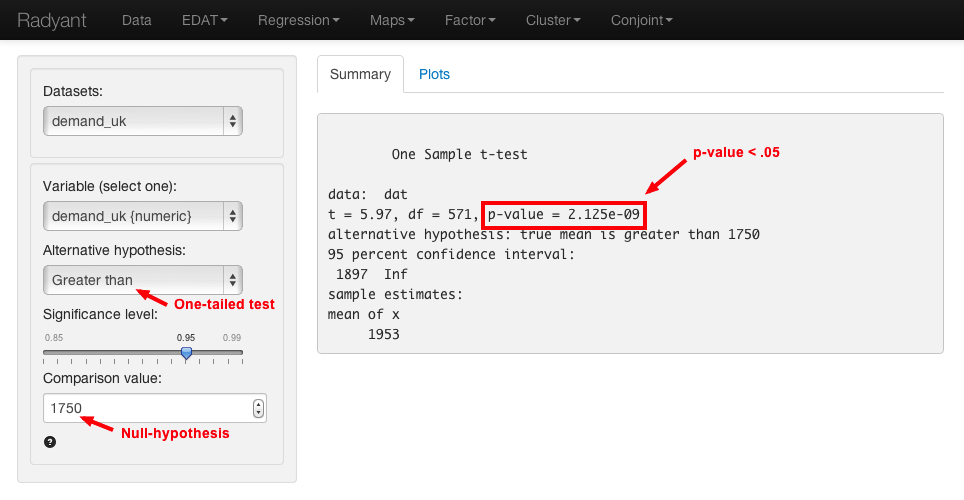

Change and remove variables in the data.

## Recode variables

http://rprogramming.net/recode-data-in-r/

Transform commands for the Tulsa-Age cross-tab:

'<25' = '<35'; 
'25-34' = '<35'; 
'35-44' = '35-54'; 
'45-54' = '35-54'; 
'55-64' = '>54'; 
'>64' = '>54'

<!--  -->